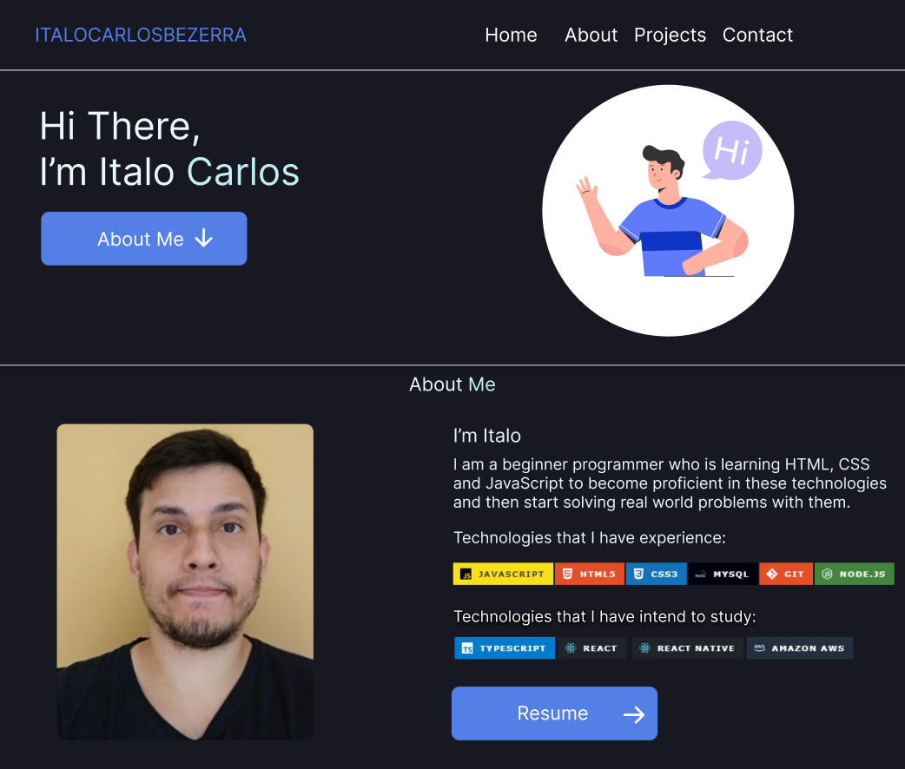
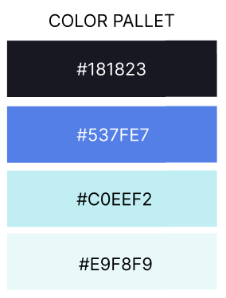

<h1 align="center"> Meu portfolio pessoal. </h1>

Este projeto teve como objetivo criar um portfólio em estilo de landing page.

 

  <a href="https://italo-portfolio.netlify.app/" target="_blank"><strong>Link da Preview</strong></a>

  

## 💾 Paleta de cores usada

  

## 🚀 Tecnologias

Esse projeto foi feito com as seguintes tecnologias:

- ✔️ HTML e CSS

 

Made by Italo Carlos Bezerra.
